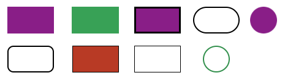
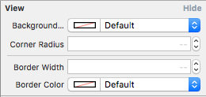

#KSView
The missing NSView extension

`KSView` is customisable NSView extension for Mac OSX implemented in Swift 2.0


##Features
- Easy to Use
- Light Mode and Fill Mode
- Simple and lightweight

##Requirements
- Mac OS X 10.10
- Xcode 7

##Installation
####Direct
Drag `KSView.swift` to your project. That is it!

####CocoaPods
[CocoaPods](http://cocoapods.org) adds supports for Swift and embedded frameworks.

To integrate KSView into your Xcode project using CocoaPods, specify it in your `Podfile`:

```ruby
use_frameworks!

pod 'KSView'
```

Then, run the following command:

```bash
$ pod install
```


##Usage
In Interface builder, drag a `Custom View` from Object Library and set `Custom Class` to `KSView`

Since KSView is `@IBDesignable`, Attribute Inspector gets updated like this.

<div align="center">

</div>

Update `Border Color`, `Corner Radius`, `Border Width` and `Border Color` and there you have KSView ready without writing a single line of code.

##License
`KSView` is released under the MIT license. See LICENSE for details.

